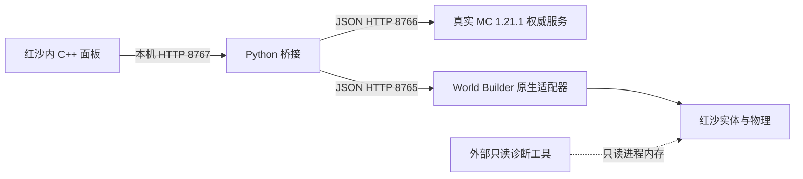

# 项目架构与接口约定

本文件描述当前已实现的实验原型。分阶段目标和验收条件见 [progress.md](progress.md)，
人物需求见 [steve-character.md](steve-character.md)。新增第四角色、生存战斗和完整背包
仍是计划，不能根据本文推定这些功能已经存在。

## 模块与数据流



| 路径 | 职责 | 边界 |
| --- | --- | --- |
| `minecraft/src/main/java/local/crimsonmc/Authority.java` | Fabric 服务端初始化、MC 配方、实验库存、方块、掉落和保存 | 使用真实 MC；当前是 36 格 `SimpleInventory`，没有 MC 玩家实体或生存战斗 |
| `bridge/service.py` | 接收面板操作，转换坐标，调用 MC，并同步红沙代理实体 | 不计算配方／掉落；只维护 `CrimsonMCPrototype` 项目的对象 |
| `bridge/red_side.py` | 原生 JSON HTTP 客户端、地面探针轮询 | 请求超时或未命中时报错，不猜测地面高度 |
| `red-side-patches/mc_panel.cpp/.h` | ImGui 操作面板、异步 WinHTTP 请求 | 与桥接通信；没有第四角色、手持物模型或心形 HUD |
| `red-side-patches/mc_inventory_ui.cpp/.h`、`mc_inventory_protocol.h` | 全物品目录、36 格选择与异步背包操作；有界 TSV 解码 | 所选槽位由 MC 返回；不是原生手持模型，异常响应不覆盖已知库存 |
| `red-side-patches/upstream.patch` | 对固定 World Builder 的 HTTP 诊断、面板接入等改动 | 是可重建的上游差异；不能只留在忽略目录 |
| `tools/` | 准备、构建、启动、安装／更新／卸载、检查和上传 | 构建不等于安装；安装记录及备份留在本机 |
| `tools/probe_characters.py` | 外部只读角色／血量链诊断 | 只申请读和查询权限，不调用游戏函数、不创建角色或写游戏内存 |
| `config/` | 可公开的默认服务端配置与诊断版本配置 | 不是用户运行时存档；未知 EXE 版本或 SHA 不使用诊断布局 |
| `artifacts/` | 已成功构建的原型自身 ASI 和 Fabric JAR | M6a 更新两份产物；没有原版游戏程序／资源 |
| `docs/`、`licenses/` | 可接手的架构、进度、检查摘要及许可证 | 未验证项和实验限制明确标记；原始进程数据不发布 |
| `vendor/`、`downloads/`、`build/` | 本机固定上游、下载依赖及构建缓存 | 忽略上传，可由准备／构建步骤恢复 |
| `runtime/`、`backups/` | 用户实验状态、日志、安装清单、探针原始证据和备份 | 忽略上传；不能依赖这些文件作为唯一开发文档 |

## 本机进程与版本

所有 HTTP 服务仅监听 `127.0.0.1`。原生插件随红沙进程运行，MC 和 Python 桥接独立运行。
MC 自身游戏端口为 `25579`，不是面板 HTTP 接口。当前验证的红沙 EXE 版本为
`1.0.0.2976`，MC 为 Java `1.21.1`。默认 MC 世界是空平地、创造模式、和平难度，
不能称为已经接入生存规则。

`Start Prototype.cmd` 调用 `tools/start_prototype.ps1`：检查并复用已有服务、启动 MC
开发服务端、再启动桥接，必要时打开 Steam 游戏。`-NoGame` 只启动后台。
`Stop Prototype.cmd` 正常停止两个后台；红沙和当前原生代理实体保留。

## 面板 → 桥接：8767

读取返回 UTF-8 **纯文本**，不是 JSON；操作请求是 JSON，成功响应也是纯文本状态摘要。
`Content-Type` 为 `application/json` 的操作请求正文最多 65536 字节。失败通常返回
HTTP 400 和错误文本，未知读取端点返回 404。不能把所有 HTTP 400 当作尚未消费材料。

| 方法／路径 | 输入 | 当前含义 |
| --- | --- | --- |
| `GET /ui/state` | 无 | 读取 MC 与红沙就绪情况、库存数量、方块数和最近操作信息 |
| `POST /ui/anchor` | `{}` | 无建筑时，在角色前方约四米建立原点并保存 |
| `POST /ui/reconnect` | `{}` | 按 MC 状态恢复／对齐本项目的红沙方块代理 |
| `POST /ui/place` | `block,x,y,z` | 在相对原点的指定格子放置 |
| `POST /ui/front` | `block` | 在前方最近列按地面及列高度放置，不是准星命中面的完整 MC 操作 |
| `POST /ui/break` | `x,y,z` | 拆除相对坐标指定方块 |
| `POST /ui/break-last` | `{}` | 拆除当前 MC 记录的最后一个非空气方块 |
| `POST /ui/craft` | `recipe` | 调用 MC 原版配方 |
| `GET /ui/catalog` | query `search,offset,limit` | MC 物品目录搜索／分页；TSV，limit 为 1～100、offset 不超出过滤后总数 |
| `GET /ui/inventory` | 无 | TSV 格子快照，固定 36 格及服务端 selectedSlot |
| `POST /ui/grant` | `item` | 免费领取该物品原版最大一组，整组放不下则回滚 |
| `POST /ui/select` | `slot` | 选择 0～35，可选空槽，不替代可见手持 |
| `POST /ui/consume` | `{}` | 明确消耗当前非方块物品 1 件；未执行弓／桶／食物用途 |
| `POST /ui/place-selected` | `x,y,z` | 由 MC 从所选格放置；兼容现有六种方块，仍是指定坐标 |
| `POST /ui/front-selected` | `{}` | 所选格放置到旧前方列算法；仍不是鼠标准星命中面 |
| `POST /ui/shutdown` | `{}` | 停止桥接 HTTP 服务；不停止 MC 或拆除原生实体 |

桥接以互斥锁串行执行操作／摘要读取，给 MC 修改生成 UUID `operationId`。
目前没有客户端重试票据，也没有跨进程事务。背包读取／领取／选择／消耗只需要 MC，
不依赖红沙或实验原点；方块放置仍须原生就绪和原点。结果未知时不会自动重试。

背包 TSV 约定（UTF-8 纯文本，名称中的 Tab／CR／LF 替换为空格）：

```text
catalog<TAB>total<TAB>offset<TAB>nextOffset（末页为 -1）
item<TAB>id<TAB>name<TAB>maxCount<TAB>placeSupported（0/1）<TAB>isBlock（0/1）

inventory<TAB>revision<TAB>selectedSlot
slot<TAB>slotIndex<TAB>id<TAB>count<TAB>maxCount<TAB>name
```

inventory 固定 36 条 slot，空槽 id 为 `-`、count/maxCount 为 0、name 为空。
解码失败不更改面板中的已知数据。目录每页最多 100 条，原生面板请求 50 条；
搜索改变时重置 offset。非结构化 summary 仍沿用原文本接口。

## 桥接 → MC：8766

请求与响应为 JSON。POST 要求 `application/json`，正文最多 65536 字节。
HTTP 线程把工作提交到 **MC 服务端线程**，等待最多五秒。参数或规则拒绝为 400，
其他失败通常为 503，响应包含 `error`。等待超时不保证已提交工作没有继续执行。

| 方法／路径 | 输入 | 输出／规则 |
| --- | --- | --- |
| `GET /api/state` | 无 | `engine,revision,inventory,blocks,schemaVersion,slots,selectedSlot,selectedItem`；保留 ID 总数，新增 36 格；没有装备栏或玩家快捷栏 |
| `GET /api/catalog` | 无 | `items:[{id,name,maxCount,isBlock,placeSupported}]`；真实 Registries.ITEM 的所有非 AIR 物品类型，默认 ItemStack 信息 |
| `POST /api/grant` | `operationId,item` | MC getMaxCount 整组插入；部分插入后放不下亦完整回滚 |
| `POST /api/select` | `operationId,slot` | 服务端保存选中格 0～35，允许空格 |
| `POST /api/consume` | `operationId` | 仅扣所选非 BlockItem 1 个；空格／方块拒绝，不跨格替补 |
| `POST /api/place-selected` | `operationId,x,y,z` | 只扣所选格，兼容六种方块；不按 ID 自动找别的格 |
| `POST /api/place` | `operationId,block,x,y,z` | MC 接受后扣一个材料、增加 revision、保存并返回状态与 operationId |
| `POST /api/break` | `operationId,x,y,z` | MC 掉落表计算，当前固定钻石镐；掉落进入库存，方块变空气 |
| `POST /api/craft` | `operationId,recipe` | 用 RecipeManager、真实合成输入和 Ingredient 验证，消费材料并返回产物／剩余物 |
| `POST /api/shutdown` | `{}` | 返回 `stopping:true`，随后正常停止 MC 并保存区块 |

MC API 使用 MC 坐标：X/Z 为 `-16..16`，Y 为 `64..95`。支持六种方块：原木、木板、
圆石、泥土、石头、工作台；三种配方：木板、木棍、工作台。面板当前只列其中五种材料。
最多记录 512 个曾触碰的坐标，空气墓碑也计入。

修改前保存库存／方块状态快照，规则或保存失败会尝试回滚。成功操作的收据仅在内存
保留最近 256 个，相同 `operationId` 在收据仍保留时返回原结果，不重复消费。
收据绑定路径和 JSON 正文，相同 ID 发出不同操作会拒绝。收据仍不跨重启持久化；
返回的重复收据是当时的结果，调用方需要最新状态时另外读取 `/api/state`。

slots 是 `[{slot,empty:true}]` 或 `[{slot,empty:false,id,name,count,maxCount,isBlock,placeSupported}]`，
selectedItem 为 null 或所选非空格的同一结构。用完设置为空 ItemStack，selectedSlot 不变。
目录中的 isBlock 不意味着已经支持红沙原生形状；placeSupported 当前只对六种基线方块为 true。
非方块“消耗”是显式库存操作，不包含物品用途、耐久或 MC 生存玩家规则。

## 桥接 → 原生适配器：8765

JSON API；`/api/status` 中 `apiVersion=1`、`ready` 和 `buildOk` 必须先检查。
本项目使用以下上游／补丁接口，不等于全部上游 API：

| 方法／路径 | 当前用途 |
| --- | --- |
| `GET /api/status` | 游戏版本、适配器与游戏线程就绪检查 |
| `GET /api/player`、`GET /api/camera` | 玩家世界坐标与相机水平方向 |
| `GET /api/prototype/render-camera` | 当前渲染相机与完整方向的诊断接口 |
| `POST /api/prototype/ground-probe` | `x,y,z,length`，提交向下物理探针并返回 202／ticket |
| `GET /api/prototype/ground-result?ticket=...` | pending 返回 202；hit 返回接触坐标；miss／失效不可继续放置 |
| `GET /api/objects?offset=...&limit=500` | 分页读取编辑器对象，筛选本项目归属 |
| `POST /api/objects` | `prefab,x,y,z,scale`，排队创建并返回 UID；仍需原生执行和验证 |
| `POST /api/objects/{uid}/project` | `name:CrimsonMCPrototype`，标记归属 |
| `DELETE /api/objects/{uid}` | 删除同步中多余的本项目对象 |

原生 HTTP 返回受理不等于场景或碰撞已创建。当前地面结果是向下球形探测，桥接采用
结果高度；不能直接推广为任意方向准星射线或方块面选择。上游还有研究写接口，但
本次诊断工具不使用它们。

## 坐标、权威和失败恢复

桥接／面板坐标为相对格子 `(x,y,z)`，Y 范围 `0..31`。
MC 坐标为 `(x,y+64,z)`，红沙位置为 `origin + (x,y,z)`，一格约一米。
已有建筑时不移动原点。红沙最多显示 128 个代理，使用固定一米蓝色网格 prefab，
没有 MC 材质或每种方块的原生形状。

MC 修改先成功，桥接随后同步显示。原生创建失败时 MC 可能已扣材料／保存；应读取
MC 状态后执行恢复，不能重复发送一次新的放置来“补显示”。桥接按项目归属、prefab、
比例和坐标匹配代理，复用已有 UID，清理多余代理；不修改原版地图物体、NPC 或地形。

## 状态和兼容约定

| 状态 | 保存位置／格式 |
| --- | --- |
| MC 库存／修复记录 | `runtime/minecraft-server/crimsonmc-lab/crimsonmc-state.json`：`schemaVersion:1,selectedSlot,revision,slots,touched`；36 格 ItemStack.CODEC，包含空气墓碑 |
| MC 实际区块 | 同目录中的原版世界文件；正常停止时保存 |
| 红沙锚点 | `runtime/bridge-origin.json`：红沙世界坐标 `x,y,z` |
| 安装归属 | `runtime/installation.json`：游戏路径、备份路径及已安装文件的 SHA |
| 诊断输出 | `runtime/character-*.json`：原始指针／本机路径，只留本机 |

MC 状态写临时文件后替换，优先原子移动，不支持时回退替换。重启按 `touched` 修复实验
坐标，正常加载不重新发初始材料。锚点不能与已有建筑分离删除。旧无 schemaVersion
存档完整校验后迁移为版本 1，默认选择槽 0，原有 revision／材料／建筑不变。
版本 1 强制 36 格、合法选中格与实验坐标；未知未来版本禁用权威 API，不覆盖其文件。
仍未引入真实 PlayerInventory／装备，引入时要新增迁移；`/api/equip` 和伤害接口不存在。

## 构建与可重建来源

`tools/prepare_environment.ps1` 校验固定官方依赖下载；`-SourceBuild` 取得固定上游并应用
补丁、复制面板源码。上游 World Builder 固定于 `4dcedc8dfe1592fdee0528894389221291900b8d`。
准备过程不覆盖不匹配的已有 checkout。原生构建用 `tools/build_worldbuilder.py` 和
`C:/msys64/ucrt64/bin` 工具链；MC 构建用 `tools/build_minecraft.ps1`，Java 21／Gradle 8.10.2。
工具下载和 vendor 不上传；来源与许可证见 [../THIRD_PARTY_NOTICES.md](../THIRD_PARTY_NOTICES.md)。

原生源码变化必须同时更新补丁及准备步骤，确认可以从固定源码重建，再发布 artifacts。
安装、更新或卸载须先关闭红沙；脚本校验本项目安装清单与哈希，不覆盖外部修改。
构建产物、已发布 artifacts 和实际安装文件是三个不同位置，需要分别核实。

## 角色诊断边界

`config/character-probe-2976.json` 保存固定来源签名和本机已检查的 EXE SHA。
探针要求 Windows 64 位 Python，枚举实际模块，通过 ReadProcessMemory／VirtualQueryEx
有界读取；EXE 版本或 SHA 不匹配时在扫描前停止。未知 RTTI 不套已知布局；签名存在
并不授予原生调用能力。所有原始输出限定在忽略上传的 `runtime/`。

Trinity 来源中的 client/server 标签在本机均指向同一个 ServerActorManager，因此保留
`source_` 标签，不能把它们当成两个已区分的 realm。真正 ClientActorManager 由独立
world-root 签名和 RTTI 链解析；多个 child 全部记录，不默认选择第一个。
坐标关联与血量候选仅是证据，`native_character_id_verified` 和
`native_f1_roster_registration_verified` 当前始终为 false。

## 关键决策

- 2026-10-04：M1 文档与只读基线已完成，用户随后同意先独立交付 M6a 背包。
- 2026-10-04：目录与堆叠由 MC 注册表决定；选择／消耗不依赖原生角色，但不声称已有可见手持。
- 2026-10-04：第四角色须为独立身份；不以替换原版三人外观作为验收。
- 2026-10-04：MC 规则继续为权威；新增生命／装备接口需要真实 MC 玩家及原生事件证据。
- 2026-10-04：仅修改结束后按授权提交上传；不使用定时上传。详见 [../AGENTS.md](../AGENTS.md)。
