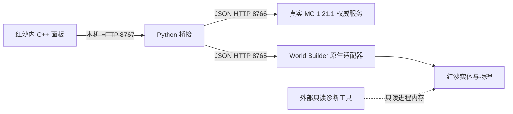

# 项目架构与接口约定

本文件描述当前已实现的实验原型。分阶段目标和验收条件见 [progress.md](progress.md)，
精简现场交接与当前责任分配见 [current-state.md](current-state.md)，
人物需求见 [steve-character.md](steve-character.md)。2026-10-06 范围调整为启用 mod 后
持续显示 Steve，兼容两套装备；用户确认心形 UI 使用红沙真实 HP／战斗规则。
独立第四身份仍是历史研究。角色替换、HP 行为桥接和
具体物品用途仍未实现，不能根据本文推定这些功能已经存在。

## 模块与数据流



| 路径 | 职责 | 边界 |
| --- | --- | --- |
| `minecraft/src/main/java/local/crimsonmc/Authority.java` | Fabric 服务端初始化、实验库存、中文名称、方块、掉落和保存 | 使用真实 MC；当前是 36 格 `SimpleInventory`，原型合成已移除，没有 MC 玩家实体或生存战斗 |
| `bridge/service.py` | 接收面板操作，转换坐标，调用 MC，并同步红沙代理实体 | 不计算配方／掉落；只维护 `CrimsonMCPrototype` 项目的对象 |
| `bridge/red_side.py` | 原生 JSON HTTP 客户端、地面探针轮询 | 请求超时或未命中时报错，不猜测地面高度 |
| `bridge/native_identity.py` | 查询实际游戏 PID、创建时间、映像路径与固定 EXE SHA；生成原生会话条件 | 仅申请 `PROCESS_QUERY_LIMITED_INFORMATION`，只缓存文件摘要，进程身份每次重新查询 |
| `bridge/native_reconcile.py` | 正式蓝代理同步、MC 提交意图与原生操作的持久日志、部分完成恢复 | 先确认新对象全集合再删旧对象；未知创建不猜 UID／不重试，不等于渲染、碰撞或跨进程事务 |
| `bridge/native_block_models.py` | 未接线的纯模型选择层：完整 block/properties、确切原木轴、候选／包身份与当前会话范围 | 只检查验证适配器提供的输入关系，不读取证据或自带生产准入；正式 service.py 仍用蓝代理 |
| `red-side-patches/mc_panel.cpp/.h` | ImGui 操作面板、每帧 HUD 接入、异步 WinHTTP 请求 | 保留原 UI；没有 Steve 替换、手持物模型或心形 HUD |
| `red-side-patches/mc_inventory_ui.cpp/.h`、`mc_inventory_protocol.h`、`mc_hotbar_layout.h` | 图标目录、36 格选择、底部九格 HUD、异步背包操作和有界解码 | 九格使用真实槽 0～8，选中 9～35 不伪造高亮；离线状态不可操作；不是原生手持／生命规则 |
| `red-side-patches/upstream.patch` | 对固定 World Builder 的 HTTP 诊断、面板接入等改动 | 是可重建的上游差异；不能只留在忽略目录 |
| `tools/` | 准备、构建、启动、安装／更新／卸载、检查和上传 | 构建不等于安装；安装记录及备份留在本机 |
| `tools/probe_characters.py` | 外部只读角色／血量链诊断；保留状态记录原始标量 | `health_candidate.plausible` 仅表示数值有界；不推断最大 HP 或时间投影值，`hud_ready=false`；只读权限，不调用游戏函数 |
| `tools/probe_health.py`、`check_health_probe.py` | 精确受控角色、ClientStatus 回链和三种元数据表映射的单条 Hp 只读观测；完整依赖回读、双采样及同句柄进程身份 | schema 2 区分 serialized key 与表索引，精确 stringKey=Hp；21 项检查及实机双采样通过，投影值、最大值、单位和 `hudReady` 保持 false |
| `tools/probe_part_catalog.py`、`check_part_catalog.py` | 四个固定原名／私有名称在两张 PAPPT 目录的外部只读查询；构造身份、桶、节点、完整字符串及双采样 | 84 个固定窗口、21 项检查；v2 实读两私有名在两目录均存在且稳定，模型加载／渲染／应用标记保持 false |
| `tools/probe_character_roster.py` | 固定 SHA／版本的只读 CharacterInfo／MercenaryInfo 及 owned 关联探针 | 行号、角色 key、佣兵 No、Actor handle 分别记录；目录观测不等于控制／注册验证 |
| `tools/probe_appearance_controller.py`、`check_appearance_controller.py` | 当前身体→外观控制器→owner、选项及 CharacterScene／参数资源／渲染选择器的两次有界只读采样 | 默认 schema 4；三个互斥 opt-in 分别读取 primary RTTI、schema 5 的 +68 引用头或 schema 7 的 Skinned PAC/PAB 与初始 Appearance 输入；不调用刷新或写选择 |
| `tools/prepare_steve_segmented.py`、`check_steve_segmented.py` | 从固定朝向候选生成独立四肢分段蒙皮 PAC，四 LOD 表面／UV 与真实骨链检查 | 不改变旧候选／默认资源；旧 PABC、头部组合、实际装备接点和实机动画仍未验收 |
| `tools/prepare_steve_parts.py`、`check_steve_parts.py` | 把固定分段候选拆成头／帽与身体／四肢两 PAC，分别配同名材质及共享 DDS | 四 LOD 的完整顶点记录与合并源一致；使用旧 neutral，不安装或选择角色 |
| `tools/prepare_steve_parts_prefab.py`、`check_steve_parts_prefab.py` | 真实 Macduff 模板的独立 CD_Nude／CD_Head，严格组件 footer 与路径往返，原字节当前 descriptor | 保留部件名／shrink／空骨架字段；原发须、外部依赖、当前 rig 适配及 actor-local 应用仍需单独验证 |
| `tools/prepare_steve_head_descriptor.py`、`check_steve_head_descriptor.py` | 为私有头 basename 复制原字节 HeadPrefabData，独立单资源报告及纯 loader | 固定 466 字节、七字段、flags 48；缺失配套文件的单变量对照，未证明运行时必需或已解决装配 |
| `tools/prepare_steve_head_mesh_control.py`、`check_steve_head_mesh_control.py` | 将固定私有 CD_Head 的 PAC 引用改回原生头，保留单组件其余语义；独立固定字节生成与 CDMW 正逆向核对 | 1921 字节、flags 0，与原生 donor 首组件逐字一致；只作定位对照，不是 Steve 外观修复 |
| `tools/prepare_steve_native_head_root.py`、`check_steve_native_head_root.py` | 原生头三 LOD 模板重建 Steve 48 点／24 面，固定 slot0 改为公共父骨 B_face_com122，真实 Head PABC 中立逆补偿及材质映射 | 其余191骨项与未知数据保持；生成时只读固定0009，纯准入只读包内五份来源；十三包仅覆盖头 PAC／材质，不代表实际位置或动画验收 |
| `tools/prepare_steve_part_table.py`、`check_steve_part_table.py` | 固定 PAPPT 原表两段分别追加私有身体／头部登记，保留所有旧行；独立解析与固定 CDMW 交叉检查 | v2 新 part 行仅声明实际 CD_Nude／CD_Head，封装及安装核对真实 prefab；全局资源表，不代替显示或 actor-local 应用 |
| `tools/prepare_steve_app.py`、`check_steve_app.py` | 显式选择一份固定 Macduff app，只改 Nude/Head 两个 Name，逐字可逆 | 00000／00002 是独立候选；BOM、换行、scale、customization、发须和装备不变；离线选择不证明当前实例使用它 |
| `tools/prepare_steve_current_rig.py`、`check_steve_current_rig.py` | 直接提取固定当前 01_0002 PABC／descriptor，按实际 byte 权重逆补偿中立姿态 | 独立 combined 候选；保留原 scale，量化后回放不是原生 shader／动画验收；后续 assembly 只复用已核对的身体补偿 |
| `tools/prepare_steve_assembly.py`、`check_steve_assembly.py` | 固定十资源组合：头身两 PAC、两 PAMI、三 DDS、两私有 prefab、当前身体 descriptor | 身体用当前 neutral 补偿；头保持原 split，Head PABC 未覆盖其唯一加权骨 93；PAB 回退与身体继承均只是离线假设 |
| `tools/prepare_steve_appearance.py`、`check_steve_appearance.py` | 从固定 0009 模板只改 Kliff meshparam 的 Body/Head 默认 MeshFileName 两属性，提供纯本地固定候选准入 | 原路径共享于 Macduff appearance，影响所有使用者；保留发须／装备及 variation/scale，不是 actor-local 或永久外观绑定 |
| `tools/build_steve_asset.py`、`SteveModelDump.java` | 离线执行哈希固定的 MC 模型构造并导出 glTF、UV、刚性关节和皮肤 | 输出仅在 ignored build；六个 MC 关节不等于已验证的红沙动画 |
| `tools/build_block_assets.py`、`check_block_assets.py` | 核对官方客户端方块资源依赖，并用原版 Java 模型类导出六种基线的真实几何/UV/纹理 | 1062 份资源清单不等于完整注册状态表；14 项离线模型尚未在红沙加载 |
| `tools/build_block_registry.py`、`check_block_registry.py` | 在隔离 build 目录运行固定官方 vanilla 数据生成器，核对 1060 种方块、26684 个合法状态及客户端资源 | 不启动世界；不是 Fabric 实际运行注册表，不表示原生模型/碰撞/特殊渲染已接通 |
| `tools/build_block_state_models.py`、`check_block_state_models.py` | 将全部 26684 状态映射至原版 variants／multipart 的全部匹配组，与原版 Java 逐项核对 | 保留加权备选和特殊渲染分类，不随机选模型，不声称原生显示或碰撞完成 |
| `tools/build_block_model_geometry.py`、`check_block_model_geometry.py` | 按完整模型／旋转／uvlock 导出 5163 项资源几何变体、51059 个原版面及原始纹理，保留真实旋转、退化面和空模型 | 可与合法状态选择表连接；alpha 像素不代替 render layer，没有染色／动画绘制、特殊渲染器、原生网格或碰撞 |
| `tools/prepare_native_steve.py`、`check_native_steve.py` | 只读提取真实红沙 PAB/PAC 及相关模板，重建并生成真实 palette 的 Steve PAC 候选 | 所有资源仅本地 build；四个 LOD 已回读，材质、动画、装备、原生显示仍未验收 |
| `tools/prepare_steve_material.py`、`check_steve_material.py` | 编码 Steve BC3/BC5/DXT1 材质候选，用独立 Pillow 解码每层 mip，重写已核对的原生材质参数 | 仅本地候选；没有 actor 引用，透明/动画/装备/受控外观未验证 |
| `tools/prepare_steve_prefab.py`、`check_steve_prefab.py` | 完整解析原生 nude prefab，仅改 CD_Nude 的 PAC 路径；保留内衣、descriptor 与骨骼依赖，生成七资源报告 | 离线候选，不选择受控角色身体，也不提供已验证的动画控制或刷新生命周期 |
| `tools/prepare_native_block.py`、`check_native_block.py` | 原木三轴静态 PAM/PAMLOD、Standard PAMI、HKX/meshinfo/prefab 候选，使用真实模板与 MC UV | 去声明 Y 轴对照已显示纹理并通过碰撞/清理；三轴完整验收、原生光照/采样仍未完成；单位立方碰撞不适用于特殊形状 |
| `tools/prepare_asset_overlay.py`、`check_asset_overlay.py` | 只读预演独立 PAMT/PAZ 与 PAPGT/PATHC，保留原索引记录并逐项解包比对 | 默认 CLI/loader 只接收 crimsonmc 新 basename；程序内部 replacement_report 仅接受固定 Kliff meshparam；只写 ignored build |
| `tools/install_asset_probe.py`、`check_asset_probe.py` | 默认 CLI 临时安装/恢复 21 项原木 overlay；共享关闭游戏、索引、备份、所有权和并发事务 | 默认 kind=oak-log；拒绝 Steve 收据与外部修改；恢复不覆盖后来存档，不接通正式 MC 模型映射 |
| `tools/prepare_steve_probe_overlay.py`、`install_steve_probe.py`、`check_steve_probe.py` | 默认十一资源；十二资源加头描述文件，十三加部件注册表，十四再加一份显式初始 app；分别输出，使用共享事务 | kind=steve-mesh-parameters，按完整计划区分 probeVariant，同一 owner／锁／active receipt；必须用本入口恢复，完整检查及实测状态见进度 |
| `tools/probe_native_block.py`、`check_native_block_probe.py` | 先探测最多七个近处平坦点，再于同一游戏实例生成/清理一块诊断原木；`--side-view` 优先现有侧方候选以减少遮挡 | 默认取点不变、不移动角色／相机；画面须另验，只清理自有 UID／变换，不消费 MC 材料 |
| `red-side-patches/mc_resource_probe.*`、`tools/probe_native_resources.py` | 对固定蓝方块/原木资源异步读取，比较实际引擎返回的长度、头部与 FNV-1a64 摘要 | 只允许固定资源枚举和每项 16KiB，结果留本机；读取成功不表示模型渲染或碰撞成功 |
| `tools/prepare_native_block_control.py`、`check_native_block_control.py` | 在独立 build 目录准备三种单资源对照：原蓝 prefab、原蓝 PAMI、仅去除原木 Y PAMI 的 XML 声明 | 每种对照的其余 20 项资源逐字保持；身份贯穿资源报告、安装收据与实体日志，不能视为原木显示验收 |
| `tools/analyze_steve_rig.py`、`check_steve_rig.py` | 固定 PAB/PABC/PAC 与官方 Steve 的关节中心、独立矩阵、中立变形和坐标约定分析 | 只输出离线证据，不修改骨骼或安装角色；合成旋转不能证明引擎动画正确 |
| `tools/prepare_steve_orientation.py`、`check_steve_orientation.py` | 独立七资源朝向候选，仅反射 PAC 的 Z/法线、反转绕序并重建原生 UV frame | 四级 LOD/权重/UV/其他资源保持；frame 编码约定有真实 donor 经验支持，未验收 shader/动画/控制绑定 |
| `config/` | 可公开的默认服务端配置与诊断版本配置 | 不是用户运行时存档；未知 EXE 版本或 SHA 不使用诊断布局 |
| `artifacts/` | 已成功构建的原型自身 ASI 和 Fabric JAR | M6a 更新两份产物；没有原版游戏程序／资源 |
| `docs/`、`licenses/` | 可接手的架构、进度、检查摘要及许可证 | 未验证项和实验限制明确标记；原始进程数据不发布 |
| `vendor/`、`downloads/`、`build/` | 本机固定上游、下载依赖及构建缓存 | 忽略上传，可由准备／构建步骤恢复 |
| `runtime/`、`backups/` | 用户实验状态、日志、安装清单、探针原始证据和备份 | 忽略上传；不能依赖这些文件作为唯一开发文档 |

## 本机进程与版本

所有 HTTP 服务仅监听 `127.0.0.1`。原生插件随红沙进程运行，MC 和 Python 桥接独立运行。
MC 自身游戏端口为 `25579`，不是面板 HTTP 接口。当前验证的红沙 EXE 版本为
`1.0.0.2976`，MC 为 Java `1.21.1`。默认 MC 世界是空平地、创造模式、和平难度，
不能称为已经接入生存规则。

`Start Prototype.cmd` 调用 `tools/start_prototype.ps1`：检查并复用已有服务、启动 MC
开发服务端、再启动桥接，必要时打开 Steam 游戏。`-NoGame` 只启动后台。
`Stop Prototype.cmd` 正常停止两个后台；红沙和当前原生代理实体保留。

## 面板 → 桥接：8767

读取返回 UTF-8 **纯文本**，不是 JSON；操作请求是 JSON，成功响应也是纯文本状态摘要。
`Content-Type` 为 `application/json` 的操作请求正文最多 65536 字节。失败通常返回
HTTP 400 和错误文本，未知读取端点返回 404。不能把所有 HTTP 400 当作尚未消费材料。

| 方法／路径 | 输入 | 当前含义 |
| --- | --- | --- |
| `GET /ui/state` | 无 | 读取 MC 与红沙就绪情况、库存数量、方块数和最近操作信息 |
| `POST /ui/anchor` | `{}` | 无建筑时，在角色前方约四米建立原点并保存 |
| `POST /ui/reconnect` | `{}` | 按 MC 状态恢复／对齐本项目的红沙方块代理 |
| `POST /ui/place` | `block,x,y,z,properties?` | 在相对原点的指定格子放置 |
| `POST /ui/front` | `block,properties?` | 在前方最近列按地面及列高度放置，不是准星命中面的完整 MC 操作 |
| `POST /ui/break` | `x,y,z` | 拆除相对坐标指定方块 |
| `POST /ui/break-last` | `{}` | 拆除当前 MC 记录的最后一个非空气方块 |
| `GET /ui/catalog` | query `search,offset,limit` | MC 物品目录搜索／分页；TSV，limit 为 1～100、offset 不超出过滤后总数 |
| `GET /ui/inventory` | 无 | TSV 格子快照，固定 36 格及服务端 selectedSlot |
| `POST /ui/grant` | `item` | 免费领取该物品原版最大一组，整组放不下则回滚 |
| `POST /ui/add-item` | `item,count,player?` | 按 ID／中文或英文名称直接添加 1～6400 件，按原版堆叠分格；全部放不下则回滚；player 默认为 console，只接受此实验背包 |
| `POST /ui/select` | `slot` | 选择 0～35，可选空槽，不替代可见手持 |
| `POST /ui/consume` | `{}` | 明确消耗当前非方块物品 1 件；未执行弓／桶／食物用途 |
| `POST /ui/place-selected` | `x,y,z,properties?` | 由 MC 从所选格放置；兼容现有六种方块，仍是指定坐标 |
| `POST /ui/front-selected` | `properties?` | 所选格放置到旧前方列算法；仍不是鼠标准星命中面 |
| `POST /ui/shutdown` | `{}` | 停止桥接 HTTP 服务；不停止 MC 或拆除原生实体 |

桥接以互斥锁串行执行操作／摘要读取，给 MC 修改生成 UUID `operationId`。
目前没有客户端重试票据，也没有跨进程事务。放置／拆除提交前把 UUID、路径、正文和
原状态写入本机日志；未解决的建造动作阻止后续放置／拆除及移动原点。背包读取／领取／
选择／消耗仍只需要 MC，不受该建造保护锁定；结果未知时不会自动重试原修改。
Restore Blocks 读取最新 MC 状态并恢复原生表示，不重发材料修改，也不保证任意客户端
重复点击具有 exactly-once 语义。MC 收据仍只有下述内存生命周期。

背包 TSV 约定（UTF-8 纯文本，名称中的 Tab／CR／LF 替换为空格）：

```text
catalog<TAB>total<TAB>offset<TAB>nextOffset（末页为 -1）
item<TAB>id<TAB>name<TAB>maxCount<TAB>placeSupported（0/1）<TAB>isBlock（0/1）

inventory<TAB>revision<TAB>selectedSlot
slot<TAB>slotIndex<TAB>id<TAB>count<TAB>maxCount<TAB>name
```

inventory 固定 36 条 slot，空槽 id 为 `-`、count/maxCount 为 0、name 为空。
解码失败不更改面板中的已知数据。目录每页最多 100 条，原生面板请求 50 条；
搜索改变时重置 offset。非结构化 summary 仍沿用原文本接口。

## 物品图片与原生窗口

`config/item-icons.json` 固定 MC 1.21.1 图片集的来源提交、ZIP 哈希和七个组件类型预览。
`prepare_item_icons.py` 仅用标准库下载、校验 ZIP、逐张 PNG CRC／完整 RGBA 数据并生成
ignored downloads 中的 1332 个独立 ID 文件与哈希清单。1325 项是原文件同名映射；
药水、喷溅／滞留药水、药箭、附魔书、谜之炖菜、山羊角由明确列出的同类型变体作预览。
这不合并 API 物品，也不改库存组件；图标不表示真实药水效果／附魔／染色／耐久状态。

安装和更新前必须退出游戏。`install_item_icons.ps1` 先校验全部复制计划，拒绝非本项目
拥有的既有文件和链接目录，再把图片安装到 `bin64/cdmodkit/mc-icons/<ID path>.png`；
全部文件加入 installation.json，卸载只删除仍匹配哈希的本项目文件。图片不打入插件或 Git。

渲染使用上游 `overlay::Thumb` 的异步解码／纹理上传和有界缓存，不做渲染线程网络请求。
物品图片只由合法 minecraft ID 决定文件路径；未加载时显示问号，空槽只显示槽号，
中文名称／数量／ID 来自 MC 的最新 TSV。目录点击图片领取一组，背包点击图片选择格子。
World Builder 主窗口默认隐藏，通过复选框显示；其每帧后台排队、保存和放置刷新继续执行，
已有 Play Mode／放置模式保持原来的显示路径，避免把红沙场景资源误认成 MC 目录。

## 桥接 → MC：8766

请求与响应为 JSON。POST 要求 `application/json`，正文最多 65536 字节。
HTTP 线程把工作提交到 **MC 服务端线程**，等待最多五秒。参数或规则拒绝为 400，
其他失败通常为 503，响应包含 `error`。等待超时不保证已提交工作没有继续执行。

| 方法／路径 | 输入 | 输出／规则 |
| --- | --- | --- |
| `GET /api/state` | 无 | `engine,revision,inventory,blocks,schemaVersion,slots,selectedSlot,selectedItem`；保留 ID 总数，新增 36 格；没有装备栏或玩家快捷栏 |
| `GET /api/catalog` | 无 | `items:[{id,name,translationKey,maxCount,isBlock,placeSupported}]`；真实 Registries.ITEM 的所有非 AIR 物品类型，每个 ID 独立一项，默认 ItemStack 的官方中文名称 |
| `POST /api/grant` | `operationId,item` | MC getMaxCount 整组插入；部分插入后放不下亦完整回滚 |
| `POST /api/add-item` | `operationId,item,count,player?` | item 可为完整／裸 ID 或精确中文／英文名；名称有歧义时拒绝并列出 ID；count 为整数 1～6400 且受 36 格实际容量限制；默认唯一目标 console；部分添加、写盘失败均回滚 |
| `POST /api/select` | `operationId,slot` | 服务端保存选中格 0～35，允许空格 |
| `POST /api/consume` | `operationId` | 仅扣所选非 BlockItem 1 个；空格／方块拒绝，不跨格替补 |
| `POST /api/place-selected` | `operationId,x,y,z,properties?` | 只扣所选格，兼容六种方块；不按 ID 自动找别的格 |
| `POST /api/place` | `operationId,block,x,y,z,properties?` | MC 校验属性并接受后扣一个材料、增加 revision、保存并返回状态与 operationId |
| `POST /api/break` | `operationId,x,y,z` | MC 掉落表计算，当前固定钻石镐；掉落进入库存，方块变空气 |
| `POST /api/shutdown` | `{}` | 返回 `stopping:true`，随后正常停止 MC 并保存区块 |

MC API 使用 MC 坐标：X/Z 为 `-16..16`，Y 为 `64..95`。支持六种方块：原木、木板、
圆石、泥土、石头、工作台。原型不再提供合成：`/ui/craft` 返回 404，`/api/craft` 返回 400，库存与 revision 不变。原版 MC 配方资源未删除，已有工作台和材料保留。旧建造下拉框列五种材料，选中格路径支持六种。
最多记录 512 个曾触碰的坐标，空气墓碑也计入。

放置请求的可选 `properties` 是字符串键值对象，例如原木 `{"axis":"x"}`。省略或空对象
使用该方块默认状态；显式 null、未知属性和非法值拒绝，由 MC `Property.parse` 决定域。
桥接四条放置路由均原样转发，限制最多 32 项、名称 1～64 字符、值 1～128 字符。
返回的 `blocks` 为真实世界中已记录坐标的非空气状态，每项包含 `x,y,z,block,properties,stateId`；
properties 完整，stateId 仅表示当前运行 MC 注册表，不写入跨版本存档。
目前仍仅开放六类基线方块；原生侧仍显示蓝色碰撞代理，面板尚无朝向选择控件。

修改前保存库存／方块状态快照，规则或保存失败会尝试回滚。成功操作的收据仅在内存
保留最近 256 个，相同 `operationId` 在收据仍保留时返回原结果，不重复消费。
收据绑定路径和 JSON 正文，相同 ID 发出不同操作会拒绝。收据仍不跨重启持久化；
返回的重复收据是当时的结果，调用方需要最新状态时另外读取 `/api/state`。
回滚和启动修复使用已提交的完整方块状态日志；尚不跟踪控制台外部编辑、邻居更新或
动态方块造成的日志外变化，不能据此宣称这些变化也能持久化。

slots 是 `[{slot,empty:true}]` 或 `[{slot,empty:false,id,name,count,maxCount,isBlock,placeSupported}]`，
selectedItem 为 null 或所选非空格的同一结构。用完设置为空 ItemStack，selectedSlot 不变。
目录中的 isBlock 不意味着已经支持红沙原生形状；placeSupported 当前只对六种基线方块为 true。
非方块“消耗”是显式库存操作，不包含物品用途、耐久或 MC 生存玩家规则。

名称由固定 MC 1.21.1 官方 `zh_cn` 语言文件解析，SHA-1 为
`f87510f4509890eaf176e0de1430f6bb326a6800`，来源为官方 asset index 17。
准备脚本将文件保存在忽略上传的 `downloads/minecraft-lang-1.21.1-zh_cn.json`；
Gradle 启动参数 `crimsonmc.languageFile` 传入绝对路径。权威服务校验哈希及全部
注册物品默认 stack 的翻译键，失败则不开启 API，不使用猜测译名。
服务端文本语言在本模块启用期间设为简体中文，停止时恢复原语言；原英文默认名称
在切换前缓存，用于控制台英文名输入。实际库存名称使用 `ItemStack.getName()`，
保留自定义名称和组件；`translationKey` 是新增只读字段，不改变 TSV 或存档格式。
官方允许部分物品具有相同显示名称（例如音乐唱片），目录保留独立 ID，输入同名时要求 ID。

## 桥接 → 原生适配器：8765

JSON API；`/api/status` 中 `apiVersion=1`、`ready` 和 `buildOk` 必须先检查。
正式同步还要求 `sessionPreconditions=true`，且 `instanceId` 等于本机查询得到的
`PID:creationTime100ns`。创建、归属分配和删除请求携带 `X-CrimsonMC-Session`。
原生服务器在分派／入队前核对该条件，进程不符返回 409、`sessionMismatch:true` 和
当前 `instanceId`；客户端请求前后检查不能代替这个服务器条件。没有 header 的旧诊断
客户端保持兼容；新桥接遇到旧 ASI 会在消费建造材料前拒绝。
归属与删除还要求 `objectPreconditions=true`，带最后 GET 回读的十个平铺条件字段：
`expectedProject,expectedPrefab,expectedX,expectedY,expectedZ,expectedYaw,expectedPitch,
expectedRoll,expectedScale,expectedHidden`。有会话 header 却缺完整条件返回 400。
原生在同一注册表临界区精确比较 float32 回读值、项目、prefab 和 hidden 后才修改，
成功返回 `conditional:true`。409 的 `object_changed` 表示字段已变化，保留冲突记录；
`busy`／`unsupported` 不执行或延迟该变更，Restore 可重新读取后评估。当前只接受普通
蓝代理，拒绝动态／standin／C5 来源；删除还拒绝已有移动代次的对象，以免与旧移动任务
重复操作物理句柄。多个对象的整体同步仍不是一个场景事务。
本项目使用以下上游／补丁接口，不等于全部上游 API：

| 方法／路径 | 当前用途 |
| --- | --- |
| `GET /api/status` | 游戏版本、适配器与游戏线程就绪检查 |
| `GET /api/player`、`GET /api/camera` | 玩家世界坐标与相机水平方向 |
| `GET /api/prototype/render-camera` | 当前渲染相机与完整方向的诊断接口 |
| `POST /api/prototype/ground-probe` | `x,y,z,length`，提交向下物理探针并返回 202／ticket |
| `GET /api/prototype/ground-result?ticket=...` | pending 返回 202；hit 返回接触坐标；miss／失效不可继续放置 |
| `POST /api/prototype/resource-probe` | 只接受一个 `resource` 固定枚举，返回 202／ticket；实际读取在游戏线程执行 |
| `GET /api/prototype/resource-result?ticket=...` | 读取状态、长度、头 16 字节、FNV-1a64 及释放结果；旧/未知 ticket 返回 410 |
| `GET /api/objects?offset=...&limit=500` | 分页读取编辑器对象，筛选本项目归属 |
| `POST /api/objects` | `prefab,x,y,z,scale`，排队创建并返回 UID；仍需原生执行和验证 |
| `POST /api/objects/{uid}/project` | `name:CrimsonMCPrototype`，标记归属 |
| `DELETE /api/objects/{uid}` | 删除同步中多余的本项目对象 |

原生 HTTP 返回受理不等于场景或碰撞已创建。当前地面结果是向下球形探测，桥接采用
结果高度；不能直接推广为任意方向准星射线或方块面选择。上游还有研究写接口，但
本次诊断工具不使用它们。

资源读取诊断有 27 个蓝块/原木固定路径，每项原生存储/解码尺寸均限 16KiB；保留最多
16 个排队或结果记录、TTL 30 秒，未执行的队列不能因过期释放容量。已完成结果可淘汰，
只对空缓冲最多尝试三次，每次经游戏线程排队。该接口不返回完整资源，不接收任意路径；
FNV-1a64 是比较摘要，不是安全校验或渲染验收。原有 GameReadFile/Range 行为保持不变。
`emptyBuffer` 沿用上游首 64 字节全零的流式读取异常判断；它是重试线索，不证明整个
文件未初始化。实际诊断仍须与蓝块对照和已校验的本地完整资源摘要相互印证。

## 坐标、权威和失败恢复

桥接／面板坐标为相对格子 `(x,y,z)`，Y 范围 `0..31`。
MC 坐标为 `(x,y+64,z)`，红沙位置为 `origin + (x,y,z)`，一格约一米。
已有建筑时不移动原点。红沙最多显示 128 个代理，使用固定一米蓝色网格 prefab，
没有 MC 材质或每种方块的原生形状。

MC 修改先成功，桥接随后同步显示。原生创建失败时 MC 可能已扣材料／保存；应读取
MC 状态后执行恢复，不能重复发送一次新的放置来“补显示”。桥接按项目归属、prefab、
完整位置／旋转／缩放匹配代理；新对象全部登记并回读后才清理多余代理。每个原生写
先持久记录意图，排队 UID 必须在同一游戏实例再次查询和确认归属，不能把 202 当完成。
明确会话拒绝可在 Restore 时重新评估；丢失创建响应且没有可靠 UID 时保留阻断，不按
相似位置认领。游戏重启时不沿用旧 UID；尚未解决的旧进程创建需要保留日志进一步诊断。
删除的未知结果只按同实例精确 GET/404 判断；其他 HTTP 错误不当作已删除。计划执行中
MC 方块／属性变化会停止旧计划，独立库存 revision 变化不改变目标。这里确认的是登记，
实际显示与碰撞仍需游戏内测试。对象条件检查解决单次变更与编辑器的竞争；若后续
对象再次变化，后续操作会重新核对并保留失败记录，不能将其称为全场景原子事务。

## 状态和兼容约定

| 状态 | 保存位置／格式 |
| --- | --- |
| MC 库存／修复记录 | `runtime/minecraft-server/crimsonmc-lab/crimsonmc-state.json`：`schemaVersion:2,selectedSlot,revision,slots,touched`；36 格 ItemStack.CODEC，每个 touched 保存 block 与完整 properties，包含空气墓碑 |
| MC 实际区块 | 同目录中的原版世界文件；正常停止时保存 |
| 红沙锚点 | `runtime/bridge-origin.json`：红沙世界坐标 `x,y,z` |
| 原生同步日志 | `runtime/bridge-native-operations.json`：schema 1、MC 未决意图及带游戏实例的计划；历史计划保存在相邻 `bridge-native-operations-history/`，原子替换前 flush/fsync，拒绝坏格式 |
| 安装归属 | `runtime/installation.json`：游戏路径、备份路径及已安装文件的 SHA |
| 诊断输出 | `runtime/character-*.json`：原始指针／本机路径，只留本机 |

MC 状态写临时文件后替换，优先原子移动，不支持时回退替换。重启按 `touched` 修复实验
坐标及完整朝向，正常加载不重新发初始材料。锚点不能与已有建筑分离删除。旧无
schemaVersion（版本 0）及版本 1 完整校验后迁移为版本 2：旧 block ID 使用 MC 默认
状态，版本 0 默认选择槽 0，版本 1 保留选择槽；原有 revision／材料／建筑不变。
版本 2 强制完整合法 properties（空气及无属性方块为 `{}`），不保存原始 stateId。
36 格、合法选中格与实验坐标检查仍保留；无效属性或未知未来版本禁用权威 API，
不覆盖其文件。版本 2 文件不能直接交给旧版插件；升级前备份留在本机 backups。
仍未引入真实 PlayerInventory／装备，引入时要新增迁移；`/api/equip` 和伤害接口不存在。

## 构建与可重建来源

`tools/prepare_environment.ps1` 校验固定官方依赖下载；`-SourceBuild` 取得固定上游并应用
补丁、复制面板源码。上游 World Builder 固定于 `4dcedc8dfe1592fdee0528894389221291900b8d`。
准备过程不覆盖不匹配的已有 checkout。原生构建用 `tools/build_worldbuilder.py` 和
`C:/msys64/ucrt64/bin` 工具链；MC 构建用 `tools/build_minecraft.ps1`，Java 21／Gradle 8.10.2。
工具下载和 vendor 不上传；来源与许可证见 [../THIRD_PARTY_NOTICES.md](../THIRD_PARTY_NOTICES.md)。

原生源码变化必须同时更新补丁及准备步骤，确认可以从固定源码重建，再发布 artifacts。
安装、更新或卸载须先关闭红沙；脚本校验本项目安装清单与哈希，不覆盖外部修改。
构建产物、已发布 artifacts 和实际安装文件是三个不同位置，需要分别核实。

## 角色诊断边界

`config/character-probe-2976.json` 保存固定来源签名和本机已检查的 EXE SHA。
探针要求 Windows 64 位 Python，枚举实际模块，通过 ReadProcessMemory／VirtualQueryEx
有界读取；EXE 版本或 SHA 不匹配时在扫描前停止。未知 RTTI 不套已知布局；签名存在
并不授予原生调用能力。所有原始输出限定在忽略上传的 `runtime/`。

Trinity 来源中的 client/server 标签在本机均指向同一个 ServerActorManager，因此保留
`source_` 标签，不能把它们当成两个已区分的 realm。真正 ClientActorManager 由独立
world-root 签名和 RTTI 链解析；多个 child 全部记录，不默认选择第一个。
坐标关联与血量候选仅是证据，`native_character_id_verified` 和
`native_f1_roster_registration_verified` 当前始终为 false。

外观探针默认及 `--render-resource-identities` 输出 schema 4，`--render-resource-links`
输出 schema 5，`--render-input-paths` 输出 schema 7；三个扩展互斥。该模式读取
已确认 SkinnedMeshComponent 的两项 PAC/PAB 文件输入属性及 +168 初始 Appearance
loader input key。两属性保留精确构造 vtable／直接 owner 门禁，初始 key 使用固定
生产链的直接 holder；三项都要求有界 NUL 与全部读取字节稳定，才提升
`renderInputPathsObserved`。独立 `initialAppearanceInputObserved` 还要求完整受控链
和两样本稳定；PAC 为空时整体可为 notReady 而此标记为 true。路径不证明已选资源、
文件加载或 descriptor 应用；原 schema 6 历史报告没有此新字段，不能补推观测结果。
默认模式不追加这些字段读取；具体偏移、失败边界与固定证据见
[native-character-contract.md](native-character-contract.md)。当前隔离检查 103/103、
该模式固定 EXE 的 46 个静态窗口通过，外观应用、恢复与 Steve 加载标记仍 false。

默认十一资源临时 Steve 包的唯一旧虚拟路径为
`character/descriptors/customizationmeta/meshparam_example_kliff.xml`。其余十项使用
私有 crimsonmc basename；`targetReplacements` 与 `candidateResources` 分开记录。
两个候选的纯 `load_candidate` 重读固定报告、模板和 payload，不能只信报告成功标记。
安装器再验证十一项解包字节、存储 flags、原索引和 metadata。`oak-log` 与
`steve-mesh-parameters` 共用 `runtime/asset-probe-active.json` 和系统锁，但恢复首先
核对 kind/owner，禁止交叉恢复。旧无 kind 的原木收据只按 oak-log 兼容。
这是关闭游戏时可准备的临时共享资源试验，尚不提供跨重载自动 Steve 或装备绑定。
可选 `--head-descriptor-report` 必须是固定单资源报告：十二项对照保留旧十一项 payload，
仅加私有头同 basename 的原字节描述文件。原两种包的报告集合恰为二项或三项，
其余流程逐项验证完整计划。`probeVariant=steve-kliff-head-descriptor-v1` 与原
`steve-kliff-meshparams-v1` 沿用相同 Steve kind；实际恢复依收据绑定的所有文件和哈希，
不凭 variant 猜测删除范围。默认十一资源 21 项及十二资源 23 项事务检查通过。

新增十三资源只加固定 PAPPT，两段各登记私有 Body／Head；十四资源必须在此基础上
显式选择 `macduff-00000` 或 `macduff-00002` 的单份 app。报告集合严格对应 2／3／4／5
项，缺依赖或未知报告拒绝；旧路径白名单为 meshparam、PAPPT 和可选的那一份 app。
一般新增资产入口仍仅允许 crimsonmc basename。新版 variant 为 `steve-kliff-part-table-v2`
或 `steve-kliff-app-00000-part-table-v2`／00002，同样绑定整个计划。PAPPT／app 均是
共享资源，其全部消费者会受影响；实际只观察到当前身体使用 00000。新包完整重建、
事务与实机结果见进度，不以生成候选代替加载验收。

2026-10-08 的 v1 注册包进入后闪退，撤回后同一存档正常。已确认新注册行沿用原版
2／7 个组件，私有 prefab 却各仅保留 1 个。v2 新行只声明实际 CD_Nude／CD_Head，
全部原行与描述目录保持；封装发布前及安装准入均独立解码真实 prefab，逐项比较
注册组件名。旧报告不满足新准入而被拒绝；恢复只依已有收据／备份，旧 v1 恢复路径
不受影响。模型、材质、骨架保持，不能据此宣称引擎崩溃或外观已修复。

原生头定位对照在 v2 十三资源上仅覆盖固定私有 head prefab 的一个模型引用，
新增 `steve-head-mesh-control-report.json` 来源，资源总数仍为 13。覆盖前必须匹配
原 assembly head SHA，覆盖后比对固定 donor 元数据、其余十二资源与实际组件名。
只接受 assembly／meshparam／head descriptor／PAPPT／head control 五报告集合，
与单 app 五报告集合互斥，不接受混合六报告；通用 loader 的重复路径拒绝保持。
variant 为 `steve-kliff-native-head-part-table-v2`，恢复仍依收据原有所有权与备份。

角色诊断的 `health_candidate` 仅解码首 int32 为零的完整 0x38 字节记录。
`current_stored_raw/base_raw/norm_raw/floor_raw/field_30_raw` 保留原始值，
`plausible` 只检查五数都在 0..10^12；受伤时 current 小于 base、norm 为零是合法情况。
删除旧 `current_raw/cap_raw/maximum_candidate_raw`，不再使用 current=base+norm 或
max(base,+30) 判定生命。`health_identity_verified/projected_current_verified/maximum_verified/
units_verified/hud_ready` 均为 false；当前没有 HUD 或桥接消费者依赖旧字段，个人存档不变。
真正受控身份、状态元数据映射、数组边界、投影时钟、最大值与行为仍须另验收。

独立 `probe_health.py` schema 2 已补齐受控身份／元数据／数组边界观测。它取精确
StatusInfoManager+A0 的命名 Hp 索引，要求选中记录 +8 的字符串为 `Hp`；+0 的
serialized key 单独保留，不能与表索引相等比较。再经 CharacterInfo／StatusGroupInfo
的有界映射只读一条 0x90 记录，u16 key 回核 Hp。71 项实读依赖回读及双采样稳定，
同一 Reader handle 的创建时间、存活和模块身份复核通过。尚未推导 HUD 当前／最大值，
不向旧 `health_candidate` 回填成功状态，不在采样失败时返回历史生命值。

可选 `--current-gate` 使用 schema 3，在相同受控 ClientStatus 中读取 +273 的特殊 Hp
门禁字节，加入全部依赖回读及双采样。仅模式 1 且该字节为 0 时给出
`normalModeOneCandidate`；模式 2／非零门禁为 unsupported，末尾身份失败撤销候选。
默认 schema 2 不读该字节，公共 Watch 不变。扩展共 28 项检查通过、开启时 23 个固定
窗口；尚未实测新增模式，current／maximum／units／HUD 就绪仍 false。

## 关键决策

- 2026-10-04：M1 文档与只读基线已完成，用户随后同意先独立交付 M6a 背包。
- 2026-10-04：目录与堆叠由 MC 注册表决定；选择／消耗不依赖原生角色，但不声称已有可见手持。
- 2026-10-04：按用户最新要求取消原型合成，增加按数量直加物品；名称改用固定官方简体中文，拒绝歧义名称，不合并变种。原版配方、库存组件和建筑保留。
- 2026-10-04：第四角色须为独立身份；不以替换原版三人外观作为验收。
- 2026-10-04：MC 规则继续为权威；新增生命／装备接口需要真实 MC 玩家及原生事件证据。
- 2026-10-06：用户改为启用 mod 期间持续 Steve、禁用恢复，兼容两套装备；心形条使用红沙真实 HP，保留红沙战斗。前述独立 MC 生命规则不再作为当前要求。
- 2026-10-06：九格与 36 格共享一份受确认／超时保护的库存；每帧 Tick 在 F8 关闭时继续异步读库存，目录只在菜单打开时请求。关闭时 NoInputs，不增加数字键／滚轮拦截；操作必须等待 MC 回读后才显示已确认选择。
- 2026-10-04：仅修改结束后按授权提交上传；不使用定时上传。详见 [../AGENTS.md](../AGENTS.md)。
